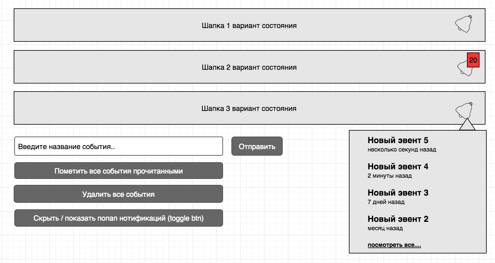

> Вы конечно можете не делать тестовое задание, если у вас есть чем похвастаться в opensource :)

### Написать простое приложение с использованием React / Redux / CSS Modules / (es6+) на основе вайрфрейма.

Необходимо заставить работать иконку нотификаций в шапке, все кнопки и покрыть redux часть тестами.

Залейте код на github, bitbucket или gitlab, а превью на github pages, heroku, вашу vps, etc... и прикрепите ссылки на код и превью к google форме https://docs.google.com/forms/d/e/1FAIpQLSf-8epA1uPIG0NoPglKbqf3-KT1ujmOFuam3bpd7UPpE0MNVw/viewform


 - Плюсом будет использование http://www.material-ui.com/, http://blueprintjs.com/ или любой другой понравившейся вам библиотеки.
 - Popover должен открываться с анимацией как тут http://codepen.io/nerdgrass/pen/KpyZRw только вниз
 - Ссылка “посмотреть все” должна просто закрывать popover
 - Popover должен показывать только 5 последних событий
 - Каждые x секунд (например 20) должно приходить новое событие с рандомным текстом.



**initial state:**


```js
[
    {
      id: 17,
      title: 'Test test test 17',
      unread: true,
      datetime: new Date(),
    },
    {
      id: 16,
      title: 'Test test test 16',
      unread: true,
      datetime: new Date().setHours((new Date()).getHours() - 2),
    },
    {
      id: 14,
      title: 'Test test test 14',
      unread: true,
      datetime: new Date().setDate((new Date()).getDate() - 1),
    },
    {
      id: 13,
      title: 'Test test test 13',
      unread: false,
      datetime: new Date().setDate((new Date()).getDate() - 3),
    },
    {
      id: 12,
      title: 'Test test test 12',
      unread: false,
      datetime: new Date().setDate((new Date()).getDate() - 8),
    },
    {
      id: 11,
      title: 'Test test test 11',
      unread: false,
      datetime: new Date().setDate((new Date()).getDate() - 31),
    },
    {
      id: 10,
      title: 'Test test test 10',
      unread: false,
      datetime: new Date().setDate((new Date()).getDate() - 160),
    }
  ]
```

